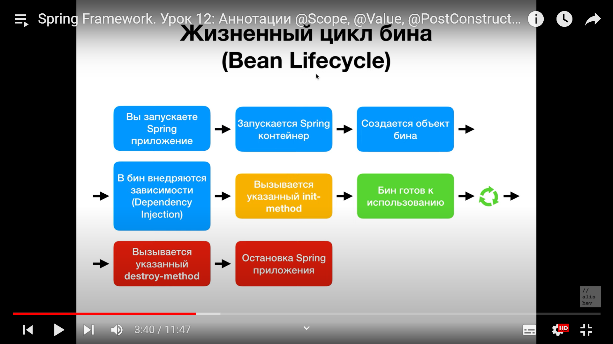

** Что такое Spring Framework? Что такое Spring Boot? Чем они отлючаются?
Если Spring Framework фокусируется на предоставлении гибкости, то Spring Boot стремится сократить длину кода и упростить разработку web-приложения.

** Что такое автоконфигурация в Spring Boot? Какие преимущества она предоставляет?
Автоконфигурация (Auto-configuration) в Spring Boot - это механизм, который позволяет автоматически настраивать приложение на основе классов, зависимостей и конфигураций, обнаруженных в класспасе. Она основана на конвенции по конфигурации и предоставляет удобный способ настройки Spring-приложений без явного указания большого количества настроек.
@SpringBootApplication
@EnableAutoConfiguration

** Как сделать один конкретный бин lazy, как сделать все бины lazy?
@Lazy
spring.main.lazy-initialization=true

** Что делать при ошибке circular dependency.
Ошибка "circular dependency" (циклическая зависимость) возникает, когда два или более бинов в Spring Framework взаимно зависят друг от друга, создавая зацикленную цепочку зависимостей. Это может привести к ошибкам и некорректному поведению приложения.
Внедрение зависимости через интерфейсы
Использование @Autowired на уровне метода или конструктора
Использование @Lazy

** Что такое @PostConstruct, @EventListener. В чем разница?
@PostConstruct - это аннотация, используемая в Java-коде для метода, который должен быть выполнен после завершения конструктора и инъекции зависимостей, но перед тем, как бин будет полностью инициализирован.
@EventListener - это аннотация, которая используется для пометки метода, который должен обрабатывать определенное событие приложения.
Метод, помеченный @EventListener, будет вызываться автоматически Spring контейнером, когда событие, указанное в аннотации, происходит в приложении.
@EventListener позволяет реагировать на события, такие как изменение состояния бинов, события приложения, события контекста и другие, и выполнять соответствующие действия в ответ на эти события.
Методы, помеченные @EventListener, должны иметь один параметр, соответствующий типу события, который они обрабатывают.

** Что такое ComponentScan? Зачем он нужен?
@ComponentScan - это аннотация в Spring Framework, которая используется для указания базового пакета, в котором следует производить сканирование и автоматическую регистрацию компонентов (бинов) в контексте приложения.

** Какие фреймворки и инструменты используются для unit-тестирования в Spring Boot?
В Spring Boot можно использовать различные фреймворки и инструменты для unit-тестирования. Вот некоторые из наиболее распространенных фреймворков и инструментов для тестирования в Spring Boot:
JUnit: JUnit является стандартным фреймворком для тестирования в Java. Он предоставляет аннотации, утверждения (assertions) и другие инструменты для написания и выполнения тестовых случаев.

** Что такое ApplicationContext?
ApplicationContext в Spring Framework представляет собой контейнер, который управляет компонентами приложения (бинами) и их зависимостями. Он является основным интерфейсом для доступа к функциональности Spring контейнера.

life cycle 
