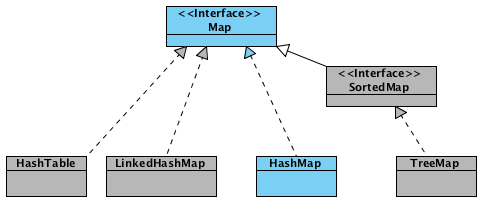

# Справочник по Java Collections Framework

## Map

### Hashtable

Hashtable — реализация такой структуры данных, как хэш-таблица. Она не позволяет использовать null в качестве значения
или ключа. **Hashtable** является синхронизированной.

### Hashmap

HashMap — коллекция является альтернативой Hashtable. Двумя основными отличиями от Hashtable являются то, что HashMap не
синхронизирована и HashMap позволяет использовать null как в качестве ключа, так и значения. Добавление элемента
выполняется за константное время O(1), но время удаления, получения зависит от распределения хэш-функции. В идеале
является константным, но может быть и линейным O(n).



**Новоявленный объект hashmap, содержит ряд свойств:**

* `table` — Массив типа `Entry[]`, который является хранилищем ссылок на списки (цепочки) значений;
* `loadFactor` — Коэффициент загрузки. Значение по умолчанию 0.75 является хорошим компромиссом между временем доступа и
  объемом хранимых данных;
* `threshold` — Предельное количество элементов, при достижении которого, размер хэш-таблицы увеличивается вдвое.
  Рассчитывается по формуле **(capacity * loadFactor)**;
* `size` — Количество элементов HashMap-а;

**Добавление элементов**

_класс Node стал заменой для Entry_

* Сначала ключ проверяется на равенство `null`. Если это проверка вернула true, будет вызван
  метод `putForNullKey(value)` (hash = 0).
* Далее генерируется хэш на основе ключа. Для генерации используется метод `hash(hashCode)`, в который передается
  `key.hashCode()`.
* С помощью метода indexFor(hash, tableLength), определяется позиция в массиве, куда будет помещен элемент.
  `(i = n - 1 & hash)`
* Теперь, зная индекс в массиве, мы получаем список (цепочку) элементов, привязанных к этой ячейке. Хэш и ключ нового
  элемента поочередно сравниваются с хэшами и ключами элементов из списка и, при совпадении этих параметров, значение
  элемента перезаписывается.
* Если же предыдущий шаг не выявил совпадений, будет вызван метод addEntry(hash, key, value, index) для добавления
  нового элемента.

**Resize и Transfer**

* Когда массив table[] заполняется до предельного значения, его размер увеличивается вдвое и происходит
  перераспределение элементов.
* Метод transfer() перебирает все элементы текущего хранилища, пересчитывает их индексы (с учетом нового размера) и
  перераспределяет элементы по новому массиву.

### Удаление элементов

* У HashMap есть такая же «проблема» как и у ArrayList — при удалении элементов размер массива `table[]` не уменьшается.
  И если в ArrayList предусмотрен метод `trimToSize()`, то в HashMap таких методов нет

### Итераторы

* HashMap имеет встроенные итераторы, такие, что вы можете получить список всех ключей `keySet()`, всех
  значений `values()` или же все пары ключ/значение `entrySet()`. Ниже представлены некоторые варианты для перебора
  элементов:

```
// 1.
for (Map.Entry<String, String> entry: hashmap.entrySet())
    System.out.println(entry.getKey() + " = " + entry.getValue());

// 2.
for (String key: hashmap.keySet())
    System.out.println(hashmap.get(key));

// 3.
Iterator<Map.Entry<String, String>> itr = hashmap.entrySet().iterator();
while (itr.hasNext())
    System.out.println(itr.next());
```
