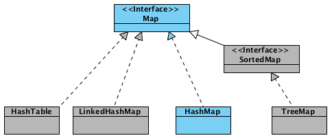
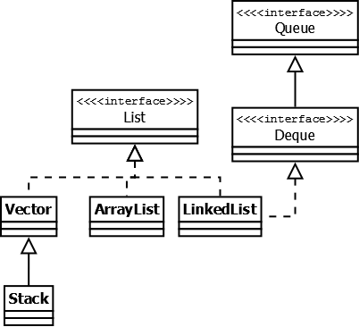

# Справочник по Java Collections Framework

## Map

### Hashtable

Hashtable — реализация такой структуры данных, как хэш-таблица. Она не позволяет использовать null в качестве значения
или ключа. **Hashtable** является синхронизированной.

### Hashmap

HashMap — коллекция является альтернативой Hashtable. Двумя основными отличиями от Hashtable являются то, что HashMap не
синхронизирована и HashMap позволяет использовать null как в качестве ключа, так и значения. Добавление элемента
выполняется за константное время O(1), но время удаления, получения зависит от распределения хэш-функции. В идеале
является константным, но может быть и линейным O(n).



**Новоявленный объект hashmap, содержит ряд свойств:**

* `table` — Массив типа `Entry[]`, который является хранилищем ссылок на списки (цепочки) значений;
* `loadFactor` — Коэффициент загрузки. Значение по умолчанию 0.75 является хорошим компромиссом между временем доступа и
  объемом хранимых данных;
* `threshold` — Предельное количество элементов, при достижении которого, размер хэш-таблицы увеличивается вдвое.
  Рассчитывается по формуле **(capacity * loadFactor)**;
* `size` — Количество элементов HashMap-а;

**Добавление элементов**

_класс Node стал заменой для Entry_

* Сначала ключ проверяется на равенство `null`. Если это проверка вернула true, будет вызван
  метод `putForNullKey(value)` (hash = 0).
* Далее генерируется хэш на основе ключа. Для генерации используется метод `hash(hashCode)`, в который передается
  `key.hashCode()`.
* С помощью метода indexFor(hash, tableLength), определяется позиция в массиве, куда будет помещен элемент.
  `(i = n - 1 & hash)`
* Теперь, зная индекс в массиве, мы получаем список (цепочку) элементов, привязанных к этой ячейке. Хэш и ключ нового
  элемента поочередно сравниваются с хэшами и ключами элементов из списка и, при совпадении этих параметров, значение
  элемента перезаписывается.
* Если же предыдущий шаг не выявил совпадений, будет вызван метод addEntry(hash, key, value, index) для добавления
  нового элемента.

**Resize и Transfer**

* Когда массив table[] заполняется до предельного значения, его размер увеличивается вдвое и происходит
  перераспределение элементов.
* Метод transfer() перебирает все элементы текущего хранилища, пересчитывает их индексы (с учетом нового размера) и
  перераспределяет элементы по новому массиву.

### Удаление элементов

* У HashMap есть такая же «проблема» как и у ArrayList — при удалении элементов размер массива `table[]` не уменьшается.
  И если в ArrayList предусмотрен метод `trimToSize()`, то в HashMap таких методов нет

### Итераторы

* HashMap имеет встроенные итераторы, такие, что вы можете получить список всех ключей `keySet()`, всех
  значений `values()` или же все пары ключ/значение `entrySet()`. Ниже представлены некоторые варианты для перебора
  элементов:

```
// 1.
for (Map.Entry<String, String> entry: hashmap.entrySet())
    System.out.println(entry.getKey() + " = " + entry.getValue());

// 2.
for (String key: hashmap.keySet())
    System.out.println(hashmap.get(key));

// 3.
Iterator<Map.Entry<String, String>> itr = hashmap.entrySet().iterator();
while (itr.hasNext())
    System.out.println(itr.next());
```

## LinkedHashMap

LinkedHashMap - это упорядоченная реализация хэш-таблицы. Здесь, в отличии от `HashMap`, порядок итерирования равен
порядку добавления элементов. Данная особенность достигается благодаря двунаправленным связям между элементами (
аналогично `LinkedList`). Но это преимущество имеет также и недостаток — увеличение памяти, которое занимет коллекция.

## TreeMap

TreeMap — реализация Map основанная на красно-чёрных деревьях. Как и LinkedHashMap является упорядоченной. По-умолчанию,
коллекция сортируется по ключам с использованием принципа "natural ordering", но это поведение может быть настроено под
конкретную задачу при помощи объекта Comparator, который указывается в качестве параметра при создании объекта TreeMap.

## WeakHashMap

WeakHashMap — реализация хэш-таблицы, которая организована с использованием weak references. Другими словами, Garbage
Collector автоматически удалит элемент из коллекции при следующей сборке мусора, если на ключ этого элеметна нет жёстких
ссылок.

# Интерфейс List

Реализации этого интерфейса представляют собой упорядоченные коллекции.



## Vector

Vector — реализация динамического массива объектов. Позволяет хранить любые данные, включая null в качестве элемента,
все операции с данными являются синхронизированными.

## Stack

Stack — данная коллекция является расширением коллекции Vector. Была добавлена в Java 1.0 как реализация стека LIFO (
last-in-first-out). Является частично синхронизированной коллекцией (кроме метода добавления push()). После добавления в
Java 1.6 интерфейса Deque, рекомендуется использовать именно реализации этого интерфейса, например ArrayDeque.

## ArrayList

ArrayList — как и Vector является реализацией динамического массива объектов. Позволяет хранить любые данные, включая
null в качестве элемента.

* Быстрый доступ к элементам по индексу за время O(1);
* Доступ к элементам по значению за линейное время O(n);
* Медленный, когда вставляются и удаляются элементы из «середины» списка;
* Позволяет хранить любые значения в том числе и null;
* Не синхронизирован.

## LinkedList

LinkedList — ещё одна реализация List. Позволяет хранить любые данные, включая null. Особенностью реализации данной
коллекции является то, что в её основе лежит двунаправленный связный список (каждый элемент имеет ссылку на предыдущий и
следующий). Благодаря этому, добавление и удаление из середины, доступ по индексу, значению происходит за линейное время
O(n), а из начала и конца за константное O(1). Так же, ввиду реализации, данную коллекцию можно использовать как стек
или очередь. Для этого в ней реализованы соответствующие методы. На Хабре также есть статья с подробным анализом и
описанием этой коллекции.

* Из LinkedList можно организовать стэк, очередь, или двойную очередь, со временем доступа O(1);
* На вставку и удаление из середины списка, получение элемента по индексу или значению потребуется линейное время O(n).
  Однако, на добавление и удаление из середины списка, используя ListIterator.add() и ListIterator.remove(), потребуется
  O(1);
* Позволяет добавлять любые значения в том числе и null. Для хранения примитивных типов использует соответствующие
  классы-оберки;
* Не синхронизирован.

# Интерфейс Set


## HashSet

HashSet — реализация интерфейса Set, базирующаяся на HashMap. Внутри использует объект HashMap для хранения данных. В
качестве ключа используется добавляемый элемент, а в качестве значения — объект-пустышка (new Object()). Из-за
особенностей реализации порядок элементов не гарантируется при добавлении.

## LinkedHashSet

LinkedHashSet — отличается от HashSet только тем, что в основе лежит LinkedHashMap вместо HashMap. Благодаря этому
отличию порядок элементов при обходе коллекции является идентичным порядку добавления элементов.

## TreeSet

TreeSet — аналогично другим классам-реализациям интерфейса Set содержит в себе объект NavigableMap, что и обуславливает
его поведение. Предоставляет возможность управлять порядком элементов в коллекции при помощи объекта Comparator, либо
сохраняет элементы с использованием "natural ordering".

# Интерфейс Queue

Этот интерфейс описывает коллекции с предопределённым способом вставки и извлечения элементов, а именно — очереди FIFO (
first-in-first-out).


## PriorityQueue

PriorityQueue — является единственной прямой реализацией интерфейса Queue (была добавлена, как и интерфейс Queue, в Java
1.5), не считая класса LinkedList, который так же реализует этот интерфейс, но был реализован намного раньше.
Особенностью данной очереди является возможность управления порядком элементов. По-умолчанию, элементы сортируются с
использованием «natural ordering», но это поведение может быть переопределено при помощи объекта Comparator, который
задаётся при создании очереди. Данная коллекция не поддерживает null в качестве элементов.

## ArrayDeque

ArrayDeque — реализация интерфейса Deque, который расширяет интерфейс Queue методами, позволяющими реализовать
конструкцию вида LIFO (last-in-first-out). Интерфейс Deque и реализация ArrayDeque были добавлены в Java 1.6. Эта
коллекция представляет собой реализацию с использованием массивов, подобно ArrayList, но не позволяет обращаться к
элементам по индексу и хранение null. Как заявлено в документации, коллекция работает быстрее чем Stack, если
используется как LIFO коллекция, а также быстрее чем LinkedList, если используется как FIFO.


