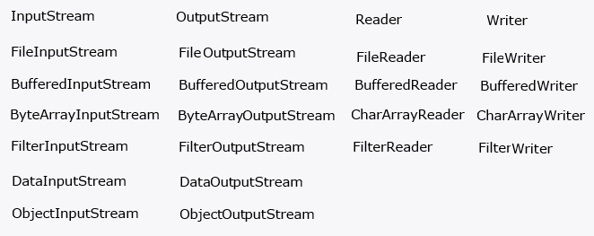

# FileReader & FileWriter

* FileReader читает данные из файла по одному символу за раз без буферизации. Это означает, что каждое обращение к файлу
  приводит к операции ввода-вывода.

* write will only take a String which must not be null and returns void
* append will take any CharSequence which can be null and return the Writer so it can be chained.
* write(int) where the int is cast to a char. append(char) must be a char type.
* write(char[] chars) takes an array of char, there is no equivalent append().

# BufferedFileReader & BufferedFileWriter

* BufferedReader предоставляет буферизацию, что означает, что он читает данные из файла блоками и хранит их в буфере.
  Это обычно более эффективно, так как уменьшает количество операций ввода-вывода.
* BufferedReader расширяет функциональность FileReader, предоставляя дополнительные методы, такие как readLine(),
  которые упрощают чтение данных в строковом формате.

# CharArrayReader & CharArrayWriter

* CharArrayReader может быть полезным в ситуациях, когда у вас уже есть данные в виде массива символов в памяти, и вам
  нужно создать поток чтения для обработки этих данных.
* Вы можете использовать CharArrayReader вместе с другими классами ввода-вывода, такими как BufferedReader или Scanner,
  чтобы улучшить функциональность. Например, вы можете создать BufferedReader поверх CharArrayReader для буферизации
  данных и улучшения производительности.
* Тестирование и отладка: При создании юнит-тестов для кода, который работает с символьными данными, CharArrayReader и
  CharArrayWriter могут использоваться для создания виртуальных источников и приемников данных без необходимости
  создания реальных файлов.
* Обработка строк в памяти: Если у вас уже есть строки в памяти, например, в виде массива символов, и вам нужно
  выполнить операции чтения или записи, используя классы, ожидающие объекты Reader или Writer, такие как BufferedReader
  или BufferedWriter, то CharArrayReader и CharArrayWriter могут быть удобными.

# FilterReader & FilterWriter

* Расширение функциональности: Оба класса позволяют расширять функциональность существующих Reader и Writer, добавляя
  дополнительные возможности обработки данных. Например, можно добавить буферизацию, преобразование данных и другие
  операции.
* Повторное использование кода: Благодаря использованию паттерна "Декоратор", вы можете создавать множество различных
  комбинаций FilterReader и FilterWriter, добавляя и комбинируя различные декораторы для получения нужной
  функциональности. Это позволяет повторно использовать код и создавать гибкие конфигурации обработки данных
* Создание пользовательских решений: Поскольку FilterReader и FilterWriter являются абстрактными классами, вы можете
  создавать собственные классы-наследники, реализующие специфическую логику обработки данных в соответствии с вашими
  требованиями.
* Прозрачность: Декораторы FilterReader и FilterWriter предоставляют прозрачное расширение функциональности, что
  означает, что пользовательский код, который использует Reader или Writer, может работать с декорированными объектами
  так же, как и с обычными

# RandomAccessFile

* "r" (read): Открывает файл только для чтения. Если файл не существует, генерируется исключение FileNotFoundException.
* "rw" (read/write): Открывает файл для чтения и записи. Если файл не существует, он будет создан.
* "rws" (read/write, sync): Открывает файл для чтения и записи, а также требует, чтобы все изменения в файле были
  записаны на физический носитель. Этот режим также синхронизирует содержимое файла с метаданными (например, информацией
  о файлах и каталогах).
* "rwd" (read/write, sync on close): Открывает файл для чтения и записи, а также требует синхронизации содержимого файла
  с метаданными при закрытии файла.

# ByteBuffer

* flip() - The limit is set to the current position and then the position is set to zero. If the mark is defined then it
  is discarded.
* compact(): Метод compact() копирует все оставшиеся данные в начало буфера и устанавливает позицию в конец
  скопированных данных. Этот метод полезен, когда вы хотите освободить пространство в начале буфера для новых данных.
* reset(): Метод reset() восстанавливает позицию буфера к предыдущей установленной метке (mark). Если метка не
  установлена, генерируется InvalidMarkException.

# FileVisitor

* preVisitDirectory() — логика, которую надо выполнять перед входом в папку;
* visitFileFailed() — что делать, если вход в файл невозможен (нет доступа, или другие причины);
* postVisitDirectory() — логика, которую надо выполнять после захода в папку.

